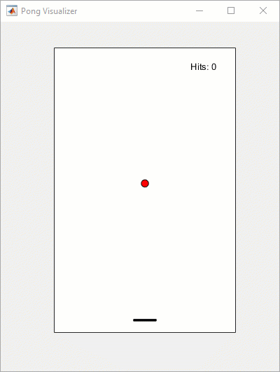

# Train Deep Reinforcement Learning Agent to Play a Variation of Pong&reg;
This example demonstrates a reinforcement learning agent playing a variation of the game of Pong&reg; using [Reinforcement Learning Toolbox&trade;](https://www.mathworks.com/products/reinforcement-learning.html). You will follow a command line workflow to create a DDPG agent in [MATLAB&reg;](https://www.mathworks.com/products/matlab.html), set up hyperparameters and then train and simulate the agent.

# Prerequisites
This example requires installation of the following software:
1. [MATLAB](https://www.mathworks.com/products/matlab.html) R2020b or later
2. [Deep Learning Toolbox&trade;](https://www.mathworks.com/products/deep-learning.html)
3. [Reinforcement Learning Toolbox](https://www.mathworks.com/products/reinforcement-learning.html)

You can download the latest version of MATLAB from this [link](https://www.mathworks.com/downloads/). For installation instructions, follow the link [here](https://www.mathworks.com/help/install/install-products.html).

# Introduction
After downloading and installing MATLAB, _clone this repository_ to get the required scripts. The following two scripts can be used to train or simulate the agent.

1. train_agent.m - script for creating and training a reinforcement learning agent
2. play_agent.m - script for playing the game

The following scripts are used to create the environment:
1. Environment.m - class for modeling the game
2. Visualizer.m - class for animation functions

##### Environment
The Environment for the game is a two dimensional space with a ball and a paddle. The ball starts with an initial velocity and moves around in the environment. The walls restrict the ball from moving outside the environment and also transfers some momentum to the ball on collision. For this reason there is a slight velocity change whenever the ball collides an object. The paddle is located at the bottom half and can move left to right to prevent the ball falling below.

##### Agent
A Deep Deterministic Policy Gradient (DDPG) reinforcement learning agent is used in this example. The agent learns to hit the ball by observing the following states in the environment:
1. x, y positions of the ball
2. x, y velocities of the ball
3. x position of the paddle
4. x velocity of the paddle

The action of the agent is the _force_ applied on the paddle in the x direction.

# Train
To create an agent and run the training, open and run the **train_agent.m** script.

# Play
To view a pre-trained agent playing the game, use the script **play_agent.m**.

# Additional Resources
For additional resources on reinforcement learning, take a look at the following:
- [What is reinforcement learning?](https://www.mathworks.com/discovery/reinforcement-learning.html)
- [RL Tech talk series with Brian Douglas](https://www.mathworks.com/videos/series/reinforcement-learning.html)
- [Free Reinforcement Learning Onramp](https://www.mathworks.com/learn/tutorials/reinforcement-learning-onramp.html)
- [Reinforcement Learning for an Inverted Pendulum with Image Data Video](https://www.mathworks.com/videos/reinforcement-learning-for-an-inverted-pendulum-with-image-data-1549467410890.html?s_tid=srchtitle)
- [Deep Reinforcement Learning for Walking Robots Video](https://www.mathworks.com/videos/deep-reinforcement-learning-for-walking-robots--1551449152203.html?s_tid=srchtitle)
- [Balancing a ball with the Kinova arm and RL Video](https://www.mathworks.com/videos/reinforcement-learning-for-ball-balancing-using-a-robot-manipulator-1603362605395.html?s_tid=srchtitle)

